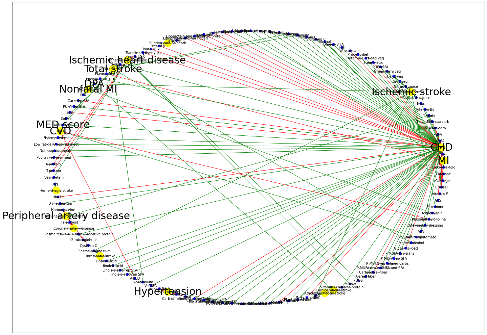
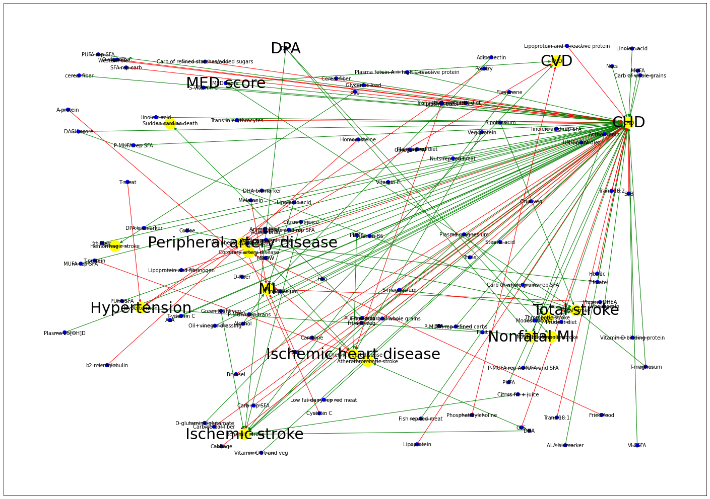

This is to re-create the network of dietary factors and its associated heart disease to study which are the important nodes. It is for learning networkx purpose


```python
import pandas as pd
import numpy as np
import networkx as nx
import re
import seaborn as sns
import matplotlib.pyplot as plt
```


```python
df = pd.read_excel(r'dietary-factors-assoc-heart-disease.xlsx')
df.head()
```


<div>
<style scoped>
    .dataframe tbody tr th:only-of-type {
        vertical-align: middle;
    }

    .dataframe tbody tr th {
        vertical-align: top;
    }

    .dataframe thead th {
        text-align: right;
    }
</style>
<table border="1" class="dataframe">
  <thead>
    <tr style="text-align: right;">
      <th></th>
      <th>Category</th>
      <th>Exposure</th>
      <th>Label</th>
      <th>Phenotype</th>
      <th>Association</th>
      <th>Effect Size</th>
      <th>PubMed_ID</th>
    </tr>
  </thead>
  <tbody>
    <tr>
      <th>0</th>
      <td>Food/Diet</td>
      <td>fish</td>
      <td>Fish</td>
      <td>CHD</td>
      <td>no</td>
      <td>NaN</td>
      <td>7885425.0</td>
    </tr>
    <tr>
      <th>1</th>
      <td>Lipid</td>
      <td>n-3 fatty acid</td>
      <td>n-3 FA</td>
      <td>CHD</td>
      <td>no</td>
      <td>NaN</td>
      <td>7885425.0</td>
    </tr>
    <tr>
      <th>2</th>
      <td>Lipid</td>
      <td>linolenic acid</td>
      <td>Linolenic acid</td>
      <td>MI</td>
      <td>neg</td>
      <td>0.41</td>
      <td>8688759.0</td>
    </tr>
    <tr>
      <th>3</th>
      <td>Lipid</td>
      <td>saturated fat</td>
      <td>SFA</td>
      <td>CHD</td>
      <td>pos</td>
      <td>2.21</td>
      <td>8688759.0</td>
    </tr>
    <tr>
      <th>4</th>
      <td>Lipid</td>
      <td>saturated fat</td>
      <td>SFA</td>
      <td>MI</td>
      <td>pos</td>
      <td>1.22</td>
      <td>8688759.0</td>
    </tr>
  </tbody>
</table>
</div>


```python
df2 = df.loc[(df['Effect Size'].notnull())]
df2 = df2[['Label','Phenotype','Association', 'Effect Size']]
df2
```


<div>
<style scoped>
    .dataframe tbody tr th:only-of-type {
        vertical-align: middle;
    }

    .dataframe tbody tr th {
        vertical-align: top;
    }

    .dataframe thead th {
        text-align: right;
    }
</style>
<table border="1" class="dataframe">
  <thead>
    <tr style="text-align: right;">
      <th></th>
      <th>Label</th>
      <th>Phenotype</th>
      <th>Association</th>
      <th>Effect Size</th>
    </tr>
  </thead>
  <tbody>
    <tr>
      <th>2</th>
      <td>Linolenic acid</td>
      <td>MI</td>
      <td>neg</td>
      <td>0.41</td>
    </tr>
    <tr>
      <th>3</th>
      <td>SFA</td>
      <td>CHD</td>
      <td>pos</td>
      <td>2.21</td>
    </tr>
    <tr>
      <th>4</th>
      <td>SFA</td>
      <td>MI</td>
      <td>pos</td>
      <td>1.22</td>
    </tr>
    <tr>
      <th>7</th>
      <td>MUFA</td>
      <td>CHD</td>
      <td>neg</td>
      <td>0.81</td>
    </tr>
    <tr>
      <th>8</th>
      <td>PUFA</td>
      <td>CHD</td>
      <td>neg</td>
      <td>0.62</td>
    </tr>
    <tr>
      <th>...</th>
      <td>...</td>
      <td>...</td>
      <td>...</td>
      <td>...</td>
    </tr>
    <tr>
      <th>284</th>
      <td>Vitamin E</td>
      <td>CHD</td>
      <td>neg</td>
      <td>0.66</td>
    </tr>
    <tr>
      <th>285</th>
      <td>Brussel</td>
      <td>CHD</td>
      <td>pos</td>
      <td>1.16</td>
    </tr>
    <tr>
      <th>286</th>
      <td>Cabbage</td>
      <td>CHD</td>
      <td>pos</td>
      <td>1.09</td>
    </tr>
    <tr>
      <th>287</th>
      <td>Carotene</td>
      <td>CHD</td>
      <td>neg</td>
      <td>0.30</td>
    </tr>
    <tr>
      <th>288</th>
      <td>Carotene</td>
      <td>CHD</td>
      <td>neg</td>
      <td>0.60</td>
    </tr>
  </tbody>
</table>
<p>153 rows × 4 columns</p>
</div>


```python
good_dietary_factors = df.loc[(df['Association'] == 'neg')]['Label'].unique()
good_dietary_factors
```


    array(['Linolenic acid', 'MUFA', 'PUFA', 'T-folate', 'Vitamin B6', 'Nuts',
           'Citrus frt + juice', 'Citrus frt juice', 'Cruc veg',
           'frt and veg', 'Green leafy veg', 'PUFA/SFA',
           'Vitamin C frt and veg', 'Prudent diet', 'Fish', 'Omega-3 FA',
           'Alcohol', 'S-vitamin C', 'T-vitamin C', 'S-magnesium',
           'T-magnesum', 'cereal fiber', 'D-fiber', 'frt fiber',
           'Adiponectin', 'Added bran', 'Whole grain', 'a-linolenic',
           'DASH score', 'Plasma 25[OH]D', 'DPA', 'EPA', 'PUFA rep SFA',
           'Coffee', 'MED score', 'Fish rep red meat',
           'Low fat dairy rep red meat', 'Nuts rep red meat',
           'Poultry rep red meat', 'Veg protein', 'Egg', 'D-magnesium',
           'b-carotene frt and veg', 'Citrus frt',
           'Plasma fetuin-A + high C-reactive protein', 'Plasma magnesium',
           'Linoleic acid', 'linoleic acid', 'Linoleic acid rep SFA',
           'linoleic acid rep SFA', 'S-potassium', 'VLCSFA',
           'Carb of whole grains', 'Carb of whole grains rep SFA',
           'MUFA rep SFA', 'PUFA and carb of whole grains', 'Apple',
           'Broccoli', 'Carrot', 'Fruit', 'Raisin', 'Tofu or soybean',
           'DHA biomarker', 'DPA biomarker', 'ALA biomarker', 'H-plant diet',
           'Plant-based diet', 'DHA', 'Vitamin D binding protein', 'MDDW',
           'PDQS', 'Cereal fiber', 'P-MUFA rep A-MUFA and SFA',
           'P-MUFA rep refined carbs', 'P-MUFA rep SFA', 'P-MUFA rep trans',
           'Modest alcohol', 'D-glutamine/glutamate', 'ALA',
           'Oil+vinegar dressing', 'Anthocyanin', 'Flavanone', 'Vitamin E',
           'Carotene'], dtype=object)


```python
bad_dietary_factors = df.loc[(df['Association'] == 'pos')]['Label'].unique()
bad_dietary_factors
```


    array(['SFA', 'SFA rep carb', 'Trans USFA rep carb',
           'High fat/low fat dair', 'Red meat/poultry and fish',
           'Stearic acid', 'Western diet', 'D-vitamin C', 'Trans',
           'Lipoprotein', 'Lipoprotein and C-reactive protein',
           'Lipoprotein and fibrinogen', 'Trans 18:1', 'Trans 18:2',
           'Trans in erythrocytes', 'plasma 15:0', 'Plasma DHEA',
           'Carb rep SFA', 'SSB', 'A-protein', 'T-protein', 'HbA1c',
           'Homocysteine', 'Fried-food', 'b2-microglobulin', 'Cystatin C',
           'A-LCD', 'Animal flesh', 'Poultry', 'T-meat',
           'Carb of refined starches/added sugars', 'Melatonin',
           'UNH-plant diet', 'Carb/cereal fiber', 'Glycemic load',
           'Phosphatidylcholine', 'GLS', 'Brussel', 'Cabbage'], dtype=object)


```python
G = nx.from_pandas_edgelist(df2, 'Label', 'Phenotype', edge_attr=['Association','Effect Size'],create_using=nx.DiGraph())
G
```


    <networkx.classes.digraph.DiGraph at 0x1889bf4b880>


```python
dic = dict(zip(df.Label, df.Category))
lis = list(dic)
s = dict(set(val for i in lis for val in dic.items()))
df2.Phenotype.unique()
import itertools
phenotype = dict(zip(df.Phenotype.unique(), itertools.repeat("Heart Disease")))
phenotype
z = s | phenotype
```


```python
for node in list(G.nodes()):
    G.nodes[node]['Category'] = z[node]
```


```python
G.nodes(data=True)
```


    NodeDataView({'Linolenic acid': {'Category': 'Lipid'}, 'MI': {'Category': 'Heart Disease'}, 'SFA': {'Category': 'Lipid'}, 'CHD': {'Category': 'Heart Disease'}, 'MUFA': {'Category': 'Lipid'}, 'PUFA': {'Category': 'Lipid'}, 'SFA rep carb': {'Category': 'Lipid'}, 'Trans USFA rep carb': {'Category': 'Lipid'}, 'T-folate': {'Category': 'Mineral'}, 'Vitamin B6': {'Category': 'Vitamin'}, 'Nuts': {'Category': 'Food/Diet'}, 'Citrus frt + juice': {'Category': 'Food/Diet'}, 'Ischemic stroke': {'Category': 'Heart Disease'}, 'Citrus frt juice': {'Category': 'Food/Diet'}, 'Cruc veg': {'Category': 'Food/Diet'}, 'frt and veg': {'Category': 'Food/Diet'}, 'Green leafy veg': {'Category': 'Food/Diet'}, 'PUFA/SFA': {'Category': 'Lipid'}, 'Stearic acid': {'Category': 'Lipid'}, 'Vitamin C frt and veg': {'Category': 'Vitamin'}, 'Prudent diet': {'Category': 'Food/Diet'}, 'Western diet': {'Category': 'Food/Diet'}, 'Fish': {'Category': 'Food/Diet'}, 'Omega-3 FA': {'Category': 'Lipid'}, 'Alcohol': {'Category': 'Alcohol'}, 'S-vitamin C': {'Category': 'Vitamin'}, 'T-vitamin C': {'Category': 'Vitamin'}, 'S-magnesium': {'Category': 'Mineral'}, 'T-magnesum': {'Category': 'Mineral'}, 'cereal fiber': {'Category': 'Fiber'}, 'D-fiber': {'Category': 'Fiber'}, 'frt fiber': {'Category': 'Fiber'}, 'Adiponectin': {'Category': 'Other'}, 'Added bran': {'Category': 'Carb'}, 'Whole grain': {'Category': 'Food/Diet'}, 'D-vitamin C': {'Category': 'Vitamin'}, 'Trans': {'Category': 'Lipid'}, 'Lipoprotein': {'Category': 'Protein'}, 'Lipoprotein and C-reactive protein': {'Category': 'Protein'}, 'Lipoprotein and fibrinogen': {'Category': 'Protein'}, 'a-linolenic': {'Category': 'Lipid'}, 'Sudden cardiac death': {'Category': 'Heart Disease'}, 'Trans 18:1': {'Category': 'Lipid'}, 'Trans 18:2': {'Category': 'Lipid'}, 'Trans in erythrocytes': {'Category': 'Lipid'}, 'plasma 15:0': {'Category': 'Lipid'}, 'Ischemic heart disease': {'Category': 'Heart Disease'}, 'DASH score': {'Category': 'Food/Diet'}, 'Total stroke': {'Category': 'Heart Disease'}, 'Plasma DHEA': {'Category': 'Lipid'}, 'Plasma 25[OH]D': {'Category': 'Vitamin'}, 'DPA': {'Category': 'Lipid'}, 'Nonfatal MI': {'Category': 'Heart Disease'}, 'EPA': {'Category': 'Lipid'}, 'Carb rep SFA': {'Category': 'Carb'}, 'PUFA rep SFA': {'Category': 'Lipid'}, 'SSB': {'Category': 'Food/Diet'}, 'Coffee': {'Category': 'Food/Diet'}, 'MED score': {'Category': 'Food/Diet'}, 'CVD': {'Category': 'Heart Disease'}, 'Fish rep red meat': {'Category': 'Food/Diet'}, 'Low fat dairy rep red meat': {'Category': 'Food/Diet'}, 'Nuts rep red meat': {'Category': 'Food/Diet'}, 'Poultry rep red meat': {'Category': 'Food/Diet'}, 'A-protein': {'Category': 'Protein'}, 'T-protein': {'Category': 'Protein'}, 'Veg protein': {'Category': 'Protein'}, 'Egg': {'Category': 'Food/Diet'}, 'Hemorrhagic stroke': {'Category': 'Heart Disease'}, 'HbA1c': {'Category': 'Other'}, 'D-magnesium': {'Category': 'Mineral'}, 'Homocysteine': {'Category': 'Other'}, 'Peripheral artery disease': {'Category': 'Heart Disease'}, 'Fried-food': {'Category': 'Food/Diet'}, 'Coronary artery disease': {'Category': 'Heart Disease'}, 'Plasma fetuin-A + high C-reactive protein': {'Category': 'Protein'}, 'b2-microglobulin': {'Category': 'Other'}, 'Cystatin C': {'Category': 'Other'}, 'Plasma magnesium': {'Category': 'Mineral'}, 'Thrombotic stroke': {'Category': 'Heart Disease'}, 'Linoleic acid': {'Category': 'Lipid'}, 'linoleic acid': {'Category': 'Lipid'}, 'Linoleic acid rep SFA': {'Category': 'Lipid'}, 'linoleic acid rep SFA': {'Category': 'Lipid'}, 'A-LCD': {'Category': 'Carb'}, 'S-potassium': {'Category': 'Mineral'}, 'VLCSFA': {'Category': 'Lipid'}, 'Animal flesh': {'Category': 'Food/Diet'}, 'Hypertension': {'Category': 'Heart Disease'}, 'Poultry': {'Category': 'Food/Diet'}, 'T-meat': {'Category': 'Food/Diet'}, 'Carb of refined starches/added sugars': {'Category': 'Carb'}, 'Carb of whole grains': {'Category': 'Carb'}, 'Carb of whole grains rep SFA': {'Category': 'Carb'}, 'MUFA rep SFA': {'Category': 'Lipid'}, 'PUFA and carb of whole grains': {'Category': 'Lipid'}, 'Fruit': {'Category': 'Food/Diet'}, 'DHA biomarker': {'Category': 'Lipid'}, 'DPA biomarker': {'Category': 'Lipid'}, 'ALA biomarker': {'Category': 'Lipid'}, 'Melatonin': {'Category': 'Other'}, 'H-plant diet': {'Category': 'Food/Diet'}, 'Plant-based diet': {'Category': 'Food/Diet'}, 'UNH-plant diet': {'Category': 'Food/Diet'}, 'DHA': {'Category': 'Lipid'}, 'Atherothrombotic stroke': {'Category': 'Heart Disease'}, 'Cardioembolic stroke': {'Category': 'Heart Disease'}, 'Vitamin D binding protein': {'Category': 'Vitamin'}, 'MDDW': {'Category': 'Food/Diet'}, 'PDQS': {'Category': 'Food/Diet'}, 'Cereal fiber': {'Category': 'Fiber'}, 'Carb/cereal fiber': {'Category': 'Carb'}, 'P-MUFA rep A-MUFA and SFA': {'Category': 'Lipid'}, 'P-MUFA rep refined carbs': {'Category': 'Lipid'}, 'P-MUFA rep SFA': {'Category': 'Lipid'}, 'P-MUFA rep trans': {'Category': 'Lipid'}, 'Glycemic load': {'Category': 'Other'}, 'Modest alcohol': {'Category': 'Food/Diet'}, 'D-glutamine/glutamate': {'Category': 'Other'}, 'ALA': {'Category': 'Lipid'}, 'Oil+vinegar dressing': {'Category': 'Food/Diet'}, 'Phosphatidylcholine': {'Category': 'Other'}, 'Anthocyanin': {'Category': 'Other'}, 'Flavanone': {'Category': 'Other'}, 'GLS': {'Category': 'Other'}, 'Vitamin E': {'Category': 'Vitamin'}, 'Brussel': {'Category': 'Food/Diet'}, 'Cabbage': {'Category': 'Food/Diet'}, 'Carotene': {'Category': 'Vitamin'}})


```python
G.edges(data=True)
```


    OutEdgeDataView([('Linolenic acid', 'MI', {'Association': 'neg', 'Effect Size': 0.41}), ('SFA', 'CHD', {'Association': 'pos', 'Effect Size': 1.07}), ('SFA', 'MI', {'Association': 'pos', 'Effect Size': 1.22}), ('MUFA', 'CHD', {'Association': 'neg', 'Effect Size': 0.81}), ('PUFA', 'CHD', {'Association': 'neg', 'Effect Size': 0.8}), ('SFA rep carb', 'CHD', {'Association': 'pos', 'Effect Size': 1.17}), ('Trans USFA rep carb', 'CHD', {'Association': 'pos', 'Effect Size': 1.93}), ('T-folate', 'CHD', {'Association': 'neg', 'Effect Size': 0.69}), ('T-folate', 'Peripheral artery disease', {'Association': 'neg', 'Effect Size': 0.9}), ('Vitamin B6', 'CHD', {'Association': 'neg', 'Effect Size': 0.67}), ('Nuts', 'CHD', {'Association': 'neg', 'Effect Size': 0.65}), ('Citrus frt + juice', 'Ischemic stroke', {'Association': 'neg', 'Effect Size': 0.81}), ('Citrus frt juice', 'Ischemic stroke', {'Association': 'neg', 'Effect Size': 0.75}), ('Cruc veg', 'Ischemic stroke', {'Association': 'neg', 'Effect Size': 0.68}), ('frt and veg', 'Ischemic stroke', {'Association': 'neg', 'Effect Size': 0.69}), ('frt and veg', 'CHD', {'Association': 'neg', 'Effect Size': 0.7}), ('Green leafy veg', 'Ischemic stroke', {'Association': 'neg', 'Effect Size': 0.79}), ('Green leafy veg', 'CHD', {'Association': 'neg', 'Effect Size': 0.77}), ('PUFA/SFA', 'CHD', {'Association': 'neg', 'Effect Size': 0.58}), ('Stearic acid', 'CHD', {'Association': 'pos', 'Effect Size': 1.19}), ('Vitamin C frt and veg', 'CHD', {'Association': 'neg', 'Effect Size': 0.94}), ('Prudent diet', 'CHD', {'Association': 'neg', 'Effect Size': 0.76}), ('Western diet', 'CHD', {'Association': 'pos', 'Effect Size': 1.46}), ('Fish', 'CHD', {'Association': 'neg', 'Effect Size': 0.87}), ('Omega-3 FA', 'CHD', {'Association': 'neg', 'Effect Size': 0.67}), ('Alcohol', 'MI', {'Association': 'neg', 'Effect Size': 0.38}), ('Alcohol', 'CHD', {'Association': 'neg', 'Effect Size': 0.85}), ('S-vitamin C', 'CHD', {'Association': 'neg', 'Effect Size': 0.75}), ('T-vitamin C', 'CHD', {'Association': 'neg', 'Effect Size': 0.73}), ('S-magnesium', 'CHD', {'Association': 'neg', 'Effect Size': 0.77}), ('S-magnesium', 'Total stroke', {'Association': 'neg', 'Effect Size': 0.74}), ('T-magnesum', 'CHD', {'Association': 'neg', 'Effect Size': 0.82}), ('T-magnesum', 'Total stroke', {'Association': 'neg', 'Effect Size': 0.83}), ('cereal fiber', 'CHD', {'Association': 'neg', 'Effect Size': 0.75}), ('D-fiber', 'CHD', {'Association': 'neg', 'Effect Size': 0.77}), ('frt fiber', 'CHD', {'Association': 'neg', 'Effect Size': 0.7}), ('Adiponectin', 'MI', {'Association': 'neg', 'Effect Size': 0.39}), ('Added bran', 'CHD', {'Association': 'neg', 'Effect Size': 0.7}), ('Whole grain', 'CHD', {'Association': 'neg', 'Effect Size': 0.82}), ('D-vitamin C', 'CHD', {'Association': 'pos', 'Effect Size': 1.23}), ('Trans', 'CHD', {'Association': 'pos', 'Effect Size': 1.33}), ('Lipoprotein', 'CHD', {'Association': 'pos', 'Effect Size': 1.9}), ('Lipoprotein and C-reactive protein', 'CHD', {'Association': 'pos', 'Effect Size': 3.67}), ('Lipoprotein and fibrinogen', 'CHD', {'Association': 'pos', 'Effect Size': 3.2}), ('a-linolenic', 'Sudden cardiac death', {'Association': 'neg', 'Effect Size': 0.3}), ('Trans 18:1', 'CHD', {'Association': 'pos', 'Effect Size': 3.1}), ('Trans 18:2', 'CHD', {'Association': 'pos', 'Effect Size': 2.8}), ('Trans in erythrocytes', 'CHD', {'Association': 'pos', 'Effect Size': 3.3}), ('plasma 15:0', 'Ischemic heart disease', {'Association': 'pos', 'Effect Size': 2.36}), ('DASH score', 'CHD', {'Association': 'neg', 'Effect Size': 0.76}), ('DASH score', 'Total stroke', {'Association': 'neg', 'Effect Size': 0.82}), ('Plasma DHEA', 'MI', {'Association': 'pos', 'Effect Size': 1.27}), ('Plasma 25[OH]D', 'CHD', {'Association': 'neg', 'Effect Size': 0.4784688995215312}), ('DPA', 'Nonfatal MI', {'Association': 'neg', 'Effect Size': 0.4}), ('DPA', 'Cardioembolic stroke', {'Association': 'neg', 'Effect Size': 0.58}), ('DPA', 'Ischemic stroke', {'Association': 'neg', 'Effect Size': 0.74}), ('EPA', 'Nonfatal MI', {'Association': 'neg', 'Effect Size': 0.23}), ('Carb rep SFA', 'CHD', {'Association': 'pos', 'Effect Size': 1.07}), ('PUFA rep SFA', 'CHD', {'Association': 'neg', 'Effect Size': 0.25}), ('SSB', 'CHD', {'Association': 'pos', 'Effect Size': 1.2}), ('Coffee', 'Total stroke', {'Association': 'neg', 'Effect Size': 0.8}), ('MED score', 'CHD', {'Association': 'neg', 'Effect Size': 0.71}), ('MED score', 'CVD', {'Association': 'neg', 'Effect Size': 0.61}), ('MED score', 'Total stroke', {'Association': 'neg', 'Effect Size': 0.87}), ('Fish rep red meat', 'CHD', {'Association': 'neg', 'Effect Size': 0.61}), ('Low fat dairy rep red meat', 'CHD', {'Association': 'neg', 'Effect Size': 0.76}), ('Nuts rep red meat', 'CHD', {'Association': 'neg', 'Effect Size': 0.53}), ('Poultry rep red meat', 'CHD', {'Association': 'neg', 'Effect Size': 0.68}), ('A-protein', 'Ischemic heart disease', {'Association': 'pos', 'Effect Size': 1.25}), ('T-protein', 'Ischemic heart disease', {'Association': 'pos', 'Effect Size': 1.21}), ('Veg protein', 'Ischemic heart disease', {'Association': 'neg', 'Effect Size': 0.93}), ('Egg', 'Hemorrhagic stroke', {'Association': 'neg', 'Effect Size': 0.37}), ('HbA1c', 'CHD', {'Association': 'pos', 'Effect Size': 1.81}), ('D-magnesium', 'CHD', {'Association': 'neg', 'Effect Size': 0.61}), ('Homocysteine', 'Peripheral artery disease', {'Association': 'pos', 'Effect Size': 2.17}), ('Fried-food', 'Coronary artery disease', {'Association': 'pos', 'Effect Size': 1.21}), ('Plasma fetuin-A + high C-reactive protein', 'CHD', {'Association': 'neg', 'Effect Size': 0.5}), ('b2-microglobulin', 'Peripheral artery disease', {'Association': 'pos', 'Effect Size': 1.5}), ('Cystatin C', 'Peripheral artery disease', {'Association': 'pos', 'Effect Size': 1.54}), ('Plasma magnesium', 'Ischemic stroke', {'Association': 'neg', 'Effect Size': 0.6369426751592356}), ('Plasma magnesium', 'Thrombotic stroke', {'Association': 'neg', 'Effect Size': 0.6024096385542169}), ('Linoleic acid', 'CHD', {'Association': 'neg', 'Effect Size': 0.42}), ('linoleic acid', 'CHD', {'Association': 'neg', 'Effect Size': 0.39}), ('Linoleic acid rep SFA', 'CHD', {'Association': 'neg', 'Effect Size': 0.45}), ('linoleic acid rep SFA', 'CHD', {'Association': 'neg', 'Effect Size': 0.43}), ('A-LCD', 'CVD', {'Association': 'pos', 'Effect Size': 1.51}), ('S-potassium', 'Total stroke', {'Association': 'neg', 'Effect Size': 0.66}), ('VLCSFA', 'CHD', {'Association': 'neg', 'Effect Size': 0.48}), ('Animal flesh', 'Hypertension', {'Association': 'pos', 'Effect Size': 1.3}), ('Poultry', 'Hypertension', {'Association': 'pos', 'Effect Size': 1.22}), ('T-meat', 'Hypertension', {'Association': 'pos', 'Effect Size': 1.3}), ('Carb of refined starches/added sugars', 'CHD', {'Association': 'pos', 'Effect Size': 1.1}), ('Carb of whole grains', 'CHD', {'Association': 'neg', 'Effect Size': 0.9}), ('Carb of whole grains rep SFA', 'CHD', {'Association': 'neg', 'Effect Size': 0.09}), ('MUFA rep SFA', 'CHD', {'Association': 'neg', 'Effect Size': 0.15}), ('PUFA and carb of whole grains', 'CHD', {'Association': 'neg', 'Effect Size': 0.8}), ('Fruit', 'Hypertension', {'Association': 'neg', 'Effect Size': 0.92}), ('DHA biomarker', 'CHD', {'Association': 'neg', 'Effect Size': 0.9}), ('DPA biomarker', 'CHD', {'Association': 'neg', 'Effect Size': 0.9}), ('ALA biomarker', 'CHD', {'Association': 'neg', 'Effect Size': 0.91}), ('Melatonin', 'MI', {'Association': 'pos', 'Effect Size': 1.4}), ('H-plant diet', 'CHD', {'Association': 'neg', 'Effect Size': 0.75}), ('Plant-based diet', 'CHD', {'Association': 'neg', 'Effect Size': 0.92}), ('UNH-plant diet', 'CHD', {'Association': 'pos', 'Effect Size': 1.32}), ('DHA', 'Atherothrombotic stroke', {'Association': 'neg', 'Effect Size': 0.53}), ('DHA', 'Ischemic stroke', {'Association': 'neg', 'Effect Size': 0.8}), ('Vitamin D binding protein', 'CHD', {'Association': 'neg', 'Effect Size': 0.6}), ('MDDW', 'Ischemic heart disease', {'Association': 'neg', 'Effect Size': 0.93}), ('PDQS', 'Ischemic heart disease', {'Association': 'neg', 'Effect Size': 0.89}), ('Cereal fiber', 'CHD', {'Association': 'neg', 'Effect Size': 0.63}), ('Carb/cereal fiber', 'CHD', {'Association': 'pos', 'Effect Size': 1.2}), ('P-MUFA rep A-MUFA and SFA', 'CHD', {'Association': 'neg', 'Effect Size': 0.81}), ('P-MUFA rep refined carbs', 'CHD', {'Association': 'neg', 'Effect Size': 0.86}), ('P-MUFA rep SFA', 'CHD', {'Association': 'neg', 'Effect Size': 0.83}), ('P-MUFA rep trans', 'CHD', {'Association': 'neg', 'Effect Size': 0.8}), ('Glycemic load', 'CHD', {'Association': 'pos', 'Effect Size': 1.98}), ('Modest alcohol', 'Total stroke', {'Association': 'neg', 'Effect Size': 0.8}), ('D-glutamine/glutamate', 'CVD', {'Association': 'neg', 'Effect Size': 0.81}), ('ALA', 'CHD', {'Association': 'neg', 'Effect Size': 0.55}), ('Oil+vinegar dressing', 'CHD', {'Association': 'neg', 'Effect Size': 0.46}), ('Phosphatidylcholine', 'CVD', {'Association': 'pos', 'Effect Size': 1.26}), ('Anthocyanin', 'Nonfatal MI', {'Association': 'neg', 'Effect Size': 0.87}), ('Flavanone', 'Ischemic stroke', {'Association': 'neg', 'Effect Size': 0.78}), ('GLS', 'CHD', {'Association': 'pos', 'Effect Size': 1.09}), ('Vitamin E', 'CHD', {'Association': 'neg', 'Effect Size': 0.66}), ('Brussel', 'CHD', {'Association': 'pos', 'Effect Size': 1.16}), ('Cabbage', 'CHD', {'Association': 'pos', 'Effect Size': 1.09}), ('Carotene', 'CHD', {'Association': 'neg', 'Effect Size': 0.6})])


```python
d = dict(G.degree)
{k: v for k, v in sorted(d.items(), key=lambda item: item[1], reverse=True)}

```


    {'CHD': 79,
     'Ischemic stroke': 9,
     'Total stroke': 7,
     'MI': 6,
     'Ischemic heart disease': 6,
     'CVD': 4,
     'Peripheral artery disease': 4,
     'Hypertension': 4,
     'DPA': 3,
     'Nonfatal MI': 3,
     'MED score': 3,
     'SFA': 2,
     'T-folate': 2,
     'frt and veg': 2,
     'Green leafy veg': 2,
     'Alcohol': 2,
     'S-magnesium': 2,
     'T-magnesum': 2,
     'DASH score': 2,
     'Plasma magnesium': 2,
     'DHA': 2,
     'Linolenic acid': 1,
     'MUFA': 1,
     'PUFA': 1,
     'SFA rep carb': 1,
     'Trans USFA rep carb': 1,
     'Vitamin B6': 1,
     'Nuts': 1,
     'Citrus frt + juice': 1,
     'Citrus frt juice': 1,
     'Cruc veg': 1,
     'PUFA/SFA': 1,
     'Stearic acid': 1,
     'Vitamin C frt and veg': 1,
     'Prudent diet': 1,
     'Western diet': 1,
     'Fish': 1,
     'Omega-3 FA': 1,
     'S-vitamin C': 1,
     'T-vitamin C': 1,
     'cereal fiber': 1,
     'D-fiber': 1,
     'frt fiber': 1,
     'Adiponectin': 1,
     'Added bran': 1,
     'Whole grain': 1,
     'D-vitamin C': 1,
     'Trans': 1,
     'Lipoprotein': 1,
     'Lipoprotein and C-reactive protein': 1,
     'Lipoprotein and fibrinogen': 1,
     'a-linolenic': 1,
     'Sudden cardiac death': 1,
     'Trans 18:1': 1,
     'Trans 18:2': 1,
     'Trans in erythrocytes': 1,
     'plasma 15:0': 1,
     'Plasma DHEA': 1,
     'Plasma 25[OH]D': 1,
     'EPA': 1,
     'Carb rep SFA': 1,
     'PUFA rep SFA': 1,
     'SSB': 1,
     'Coffee': 1,
     'Fish rep red meat': 1,
     'Low fat dairy rep red meat': 1,
     'Nuts rep red meat': 1,
     'Poultry rep red meat': 1,
     'A-protein': 1,
     'T-protein': 1,
     'Veg protein': 1,
     'Egg': 1,
     'Hemorrhagic stroke': 1,
     'HbA1c': 1,
     'D-magnesium': 1,
     'Homocysteine': 1,
     'Fried-food': 1,
     'Coronary artery disease': 1,
     'Plasma fetuin-A + high C-reactive protein': 1,
     'b2-microglobulin': 1,
     'Cystatin C': 1,
     'Thrombotic stroke': 1,
     'Linoleic acid': 1,
     'linoleic acid': 1,
     'Linoleic acid rep SFA': 1,
     'linoleic acid rep SFA': 1,
     'A-LCD': 1,
     'S-potassium': 1,
     'VLCSFA': 1,
     'Animal flesh': 1,
     'Poultry': 1,
     'T-meat': 1,
     'Carb of refined starches/added sugars': 1,
     'Carb of whole grains': 1,
     'Carb of whole grains rep SFA': 1,
     'MUFA rep SFA': 1,
     'PUFA and carb of whole grains': 1,
     'Fruit': 1,
     'DHA biomarker': 1,
     'DPA biomarker': 1,
     'ALA biomarker': 1,
     'Melatonin': 1,
     'H-plant diet': 1,
     'Plant-based diet': 1,
     'UNH-plant diet': 1,
     'Atherothrombotic stroke': 1,
     'Cardioembolic stroke': 1,
     'Vitamin D binding protein': 1,
     'MDDW': 1,
     'PDQS': 1,
     'Cereal fiber': 1,
     'Carb/cereal fiber': 1,
     'P-MUFA rep A-MUFA and SFA': 1,
     'P-MUFA rep refined carbs': 1,
     'P-MUFA rep SFA': 1,
     'P-MUFA rep trans': 1,
     'Glycemic load': 1,
     'Modest alcohol': 1,
     'D-glutamine/glutamate': 1,
     'ALA': 1,
     'Oil+vinegar dressing': 1,
     'Phosphatidylcholine': 1,
     'Anthocyanin': 1,
     'Flavanone': 1,
     'GLS': 1,
     'Vitamin E': 1,
     'Brussel': 1,
     'Cabbage': 1,
     'Carotene': 1}


```python
edges = G.edges()
colors = [G[u][v]['Association'] for u,v in edges]
colors = list(map(lambda x: x.replace('neg', 'g'), colors))
colors = list(map(lambda x: x.replace('pos', 'r'), colors))
nodes = G.nodes()
node_sizes = [500 if nodes[n]['Category'] == 'Heart Disease' else 50 for n in nodes]
node_colors =['yellow' if nodes[n]['Category'] == 'Heart Disease' else 'blue' for n in nodes]
node_fonts =[15 if nodes[n]['Category'] == 'Heart Disease' else 5 for n in nodes]
# node_fonts
for k,v in d.items():
    if v > 2:
        d[k] = 30
    else:
        d[k] = 5

```


```python
# Draw the graph using the circular layout
from matplotlib.pyplot import text
plt.figure(3,figsize=(25,18)) 
pos = nx.circular_layout(G)
nx.draw_networkx(G, pos=pos, node_size=node_sizes,node_color=node_colors, font_size=10, edge_color=colors)
for node, (x, y) in pos.items():
    text(x, y, node, fontsize=d[node], ha='center', va='center')
```


    

    


```python
# Draw the graph using the random layout
plt.figure(3,figsize=(25,18)) 
pos = nx.random_layout(G)
nx.draw_networkx(G, pos=pos, node_size=node_sizes,node_color=node_colors, font_size=10, edge_color=colors)
for node, (x, y) in pos.items():
    text(x, y, node, fontsize=d[node], ha='center', va='center')
```


    

    


Degree Centrality Assumption: important nodes have many connections


```python
import operator
degCent = nx.degree_centrality(G)
top_nodes = sorted(degCent.items(), key=operator.itemgetter(1), reverse = True)[0:100]
disease_node=[]
good_factors=[]
bad_factors=[]
[disease_node.append(i) for i in top_nodes if i[0] in phenotype.keys()]
[good_factors.append(i) for i in top_nodes if i[0] in good_dietary_factors]
[bad_factors.append(i) for i in top_nodes if i[0] in bad_dietary_factors]
disease_node[0:5]
```


    [('CHD', 0.6171875),
     ('Ischemic stroke', 0.0703125),
     ('Total stroke', 0.0546875),
     ('MI', 0.046875),
     ('Ischemic heart disease', 0.046875)]


## From the dataset, we notice that CHD are connected to many of the dietary nodes

Dietary/ Medicine Condition Nodes


```python
good_factors[0:20]
```


    [('DPA', 0.0234375),
     ('MED score', 0.0234375),
     ('T-folate', 0.015625),
     ('frt and veg', 0.015625),
     ('Green leafy veg', 0.015625),
     ('Alcohol', 0.015625),
     ('S-magnesium', 0.015625),
     ('T-magnesum', 0.015625),
     ('DASH score', 0.015625),
     ('Plasma magnesium', 0.015625),
     ('DHA', 0.015625),
     ('Linolenic acid', 0.0078125),
     ('MUFA', 0.0078125),
     ('PUFA', 0.0078125),
     ('Vitamin B6', 0.0078125),
     ('Nuts', 0.0078125),
     ('Citrus frt + juice', 0.0078125),
     ('Citrus frt juice', 0.0078125),
     ('Cruc veg', 0.0078125),
     ('PUFA/SFA', 0.0078125)]


Interestingly to see Alchohol listed as good factors as it bring neg impact to heart disease


```python
bad_factors[0:20]
```


    [('SFA', 0.015625),
     ('SFA rep carb', 0.0078125),
     ('Trans USFA rep carb', 0.0078125),
     ('Stearic acid', 0.0078125),
     ('Western diet', 0.0078125),
     ('D-vitamin C', 0.0078125),
     ('Trans', 0.0078125),
     ('Lipoprotein', 0.0078125),
     ('Lipoprotein and C-reactive protein', 0.0078125),
     ('Lipoprotein and fibrinogen', 0.0078125),
     ('Trans 18:1', 0.0078125),
     ('Trans 18:2', 0.0078125),
     ('Trans in erythrocytes', 0.0078125),
     ('plasma 15:0', 0.0078125),
     ('Plasma DHEA', 0.0078125),
     ('Carb rep SFA', 0.0078125),
     ('SSB', 0.0078125),
     ('A-protein', 0.0078125),
     ('T-protein', 0.0078125),
     ('HbA1c', 0.0078125)]


```python
# TBC
```

# Reference:
## A SYSTEMATIC COMPREHENSIVE LONGITUDINAL EVALUATION OF DIETARY FACTORS ASSOCIATED WITH ACUTE MYOCARDIAL INFARCTION AND FATAL CORONARY HEART DISEASE
#### SOODABEH MILANLOUEI, GIULIA MENICHETTI, YANPING LI, JOSEPH LOSCALZO, WALTER C. WILLETT & ALBERT-LÁSZLÓ BARABÁSI
<br>

<br>
##### The nodes of the graph are dietary exposures (circles) and cardiovascular diseases (diamonds) as two sets of nodes. Each studied association is shown by an edge whose color denotes the “direction” (i.e., positive or negative) of the association. Green and red links indicate negative and positive associations, respectively, between an exposure and a disease. Grey links denote associations that were studied but not found to be statistically significant. In the context of NHS, CHD refers to non-fatal MI and fatal coronary heart disease; also, coronary artery disease (CAD) refers to non-fatal MI and fatal coronary artery disease. Cardiovascular disease (CVD) is defined as a composite of coronary artery disease and non-fatal or fatal stroke. Source data are provided in Source Data - Figure 1.xlsx. The figure aims to illustrate the body of work derived from NHS data on cardiovascular diseases. A detailed comparison of the result of our analysis with previous NHS-related work and other findings in the literature is provided in the section “Comparison with the literature”.

